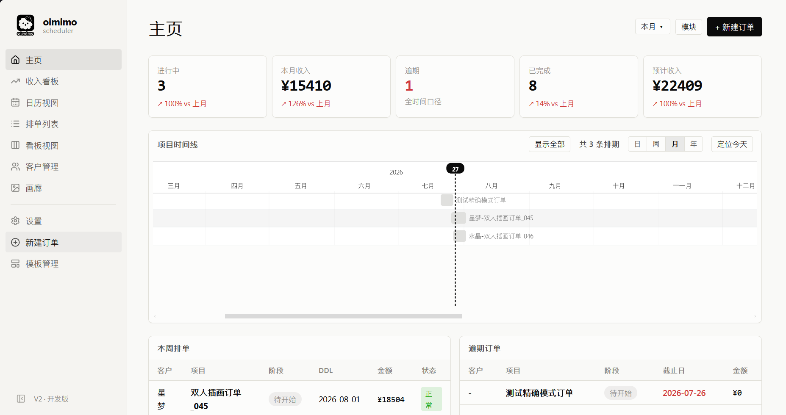
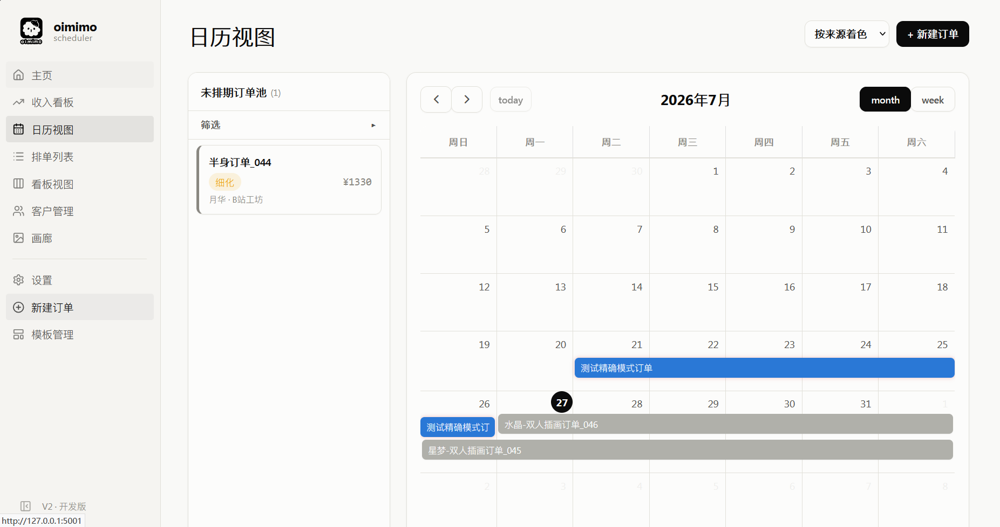
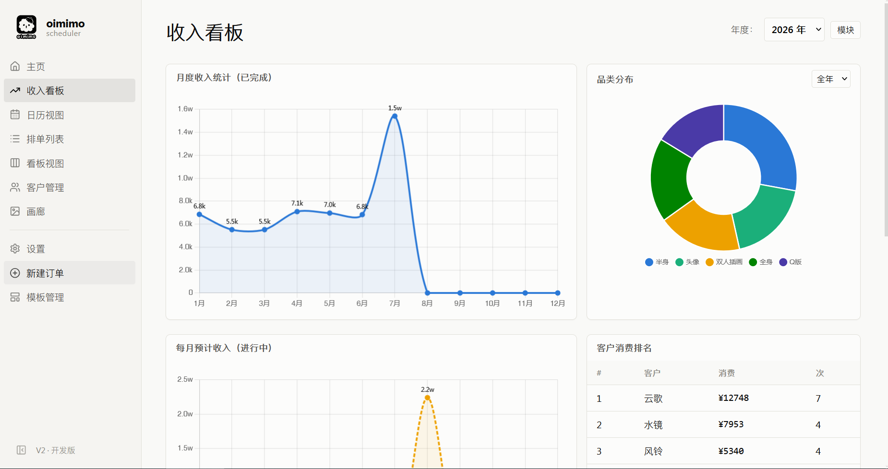

<div align="center">


# oimimo 画师排单助手

**独立插画师的本地接单排单管理工具**

接单 → 排期 → 跟进 → 收款 → 统计 → 归档

</div>

数据全部保存在本地 SQLite 单文件中，无需联网、无账号注册、不上传任何数据。

> **[使用说明书](docs/USER_GUIDE.md)** — 完整功能使用指南，覆盖每个页面的详细操作说明

## 功能一览

### 核心视图

- **主页仪表盘**：统计卡 5 指标（进行中 / 本月收入含环比 / 逾期 / 已完成 / 待收金额）、SVG 甘特图排期（日/周/月/年视图，拖拽改期）、本周排单表、逾期提醒
- **日历视图**：月/周视图，未排期池拖拽入历，事件拖拽移动/调时长自动保存，5 种着色模式（来源/阶段/DDL/收款/类别），**日历订阅**（iOS/Android 局域网 ICS 同步）
- **排单列表**：12 列分页表，阶段/来源/DDL/类别/关键词多维筛选，批量操作，归档管理，Markdown 导出
- **看板**：阶段列拖拽流转，快捷推进按钮，阶段时间轴，列统计

### 订单与财务

- **三种表单模式**：居中模态（快速创建）/ 右侧抽屉（上下文编辑）/ 完整页（详情编辑），支持订单模板一键建单
- **分期收款**：整单/分期两种收款方式，分期按到账日归属月份，收款时间线逐笔记账，收齐自动结算归档
- **先折后费计算链**：折扣 → 平台手续费 → 实际到账，VIP 客户默认折扣自动带出
- **截稿倒计时**：剩余天数徽标（逾期红 / 临期橙 / 充裕绿），实时刷新
- **收入看板**：月度收入 / 年累进 / 品类分布图表，时薪统计与报价建议，gridstack 自定义布局

### 小工具平台

- **价目表**：长条视图 + 卡片视图双模式，多例图，分类导出 PNG，价格区间，编辑拖拽排序
- **小票打印机**：复古小票渲染（制品明细 / 赠品 / 附加服务 / 倍率折扣 / 条码 / 锯齿边），四预设样式，样式可存为模板
- **回复模板**：分组侧栏 + 卡片展示，一键复制，关键词搜索高亮

### 个性化

- **主题设置**：6 套预设主题 + 深色主题引擎 + 自定义 CSS 主题导入
- **着色模式**：5 种着色维度独立调色板 + 配色预设（保存/选用/更新/删除）
- **阶段流程管理**：拖拽排序 + 自动均分进度百分比 + 流程预设
- **来源/类别管理**：自定义来源费率、稿件类别增删合并、VIP 折扣预设
- **外观**：字号 4 档、字体 3 种、快捷键自定义

## 界面预览

> 以下截图均为虚拟演示数据。

**主页仪表盘** — 统计卡 + 甘特图排期 + 本周排单 / 逾期提醒



**日历视图** — 月/周视图，未排期池拖拽入历，5 种着色模式



**收入看板** — 月度收入统计、品类分布、时薪统计



## 安装使用

前往 [Releases](../../releases) 页面下载：

| 文件 | 说明 |
|---|---|
| `oimimo-setup.exe` | 安装版：双击安装，自选安装路径，自动创建开始菜单和桌面快捷方式 |
| `oimimo-portable-win64.zip` | 便携版：解压到任意文件夹，双击 `oimimo.exe` 运行 |

启动后程序会自动打开浏览器（本地地址 `http://127.0.0.1:1096`），所有数据保存在程序目录。

> **关于 Windows SmartScreen 提示**
> 首次运行时可能弹出"Windows 已保护你的电脑"提示。这是因为本软件是个人开发者发布、未购买代码签名证书，并非软件有问题。点击 **"更多信息"** → **"仍要运行"** 即可。源代码公开在本仓库，可自行审阅。

### 数据位置

- **安装版**：数据库位于安装目录下的 `orders.db`（默认 `%LOCALAPPDATA%\oimimo\`，安装时可自选）
- **便携版**：数据库位于解压目录下的 `orders.db`
- **备份**：只需复制 `orders.db` + `uploads/` 文件夹；应用内也提供一键备份/恢复/自定义备份路径

### 日历订阅

启用后（设置 → 日历订阅），程序会在本地 1097 端口开启局域网订阅通道。将生成的 ICS 链接添加到手机日历（iOS/Android）即可同步排期与截稿日。首次启用时 Windows 会弹窗询问网络权限，点击"允许"即可。

## 从源码运行

需要 Python 3.9+：

```bash
pip install -r requirements.txt
python launcher.py        # 启动器模式（推荐，含托盘图标）
# 或
python app.py             # 直接运行 Flask（调试用）
```

## 技术栈

| 层 | 技术 |
|---|---|
| 后端 | Python Flask 3 + Pydantic v2 |
| 数据库 | SQLite（WAL 模式，单文件零配置） |
| 前端 | Jinja2 模板 + HTMX 2（无构建步骤，无 Node 依赖） |
| 可视化 | 自研 SVG 甘特图 / FullCalendar 6 / Chart.js 4（全部本地 vendor，离线可用） |
| 交互 | SortableJS（看板/阶段拖拽）/ gridstack（收入看板布局） |
| 打包 | PyInstaller（onedir）+ Inno Setup 6 |

## 文档

- [AGENTS.md](AGENTS.md) — 给 AI 编码助手 / 开发者的项目地图
- [docs/ARCHITECTURE.md](docs/ARCHITECTURE.md) — 架构：路由全表、DB schema、核心机制
- [docs/DESIGN.md](docs/DESIGN.md) — 设计系统：Design Tokens、主题、组件规范
- [docs/PROJECT.md](docs/PROJECT.md) — 项目说明书：功能矩阵、业务口径
- [CHANGELOG.md](CHANGELOG.md) — 版本更新记录

## 许可证

[MIT](LICENSE)
